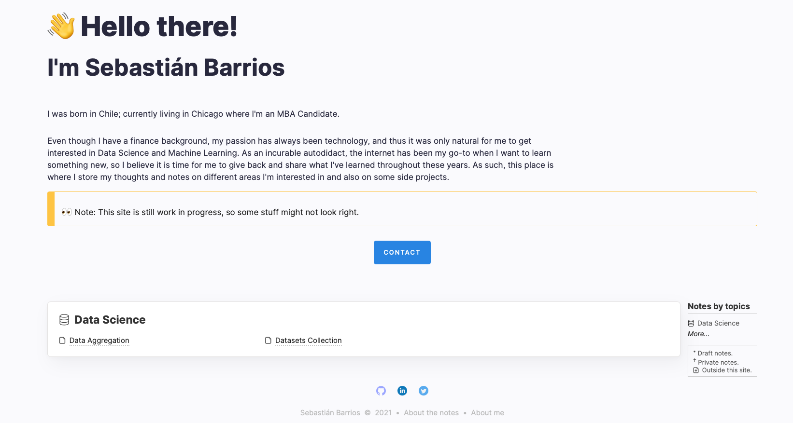

**This website is based on the [amazing theme](https://github.com/dinhanhthi/dinhanhthi.com) made by [Anh-Thi DINH](https://github.com/dinhanhthi/)**




# Build & dev locally

At the first time after cloning,

``` bash
# install nodejs
# https://github.com/nodesource/distributions/blob/master/README.md#installation-instructions

npm i # run once
```

```
# If you have any problem with the installation sharp?
# Try to change the python path to python2
# Best practice: create a python env containing python just for this task!

# In case you have python2 installed but it's not currently default
# You can choose python version in npm with
npm config set python python2
```

```
# If you have problems with libvips (MacOS??)?
# install it first
brew install vips
# then again,
npm i
```

Because of the weakness of eleventy, we have to do below things to make the dev locally much faster!

``` bash
# Install http-server to make a separated server
# (we don't intend to serve our eleventy site, just build it)
sudo npm install http-server -g

# Go to the main folder and then
mkdir _live

npm run local:build # a folder _site will be created

# Run the serve on folder _live
# (You need to do this everytime you restart the computer)
npm run local:serve

# Each time we want to build, run in another terminal
npm run local:build
```

### Update Fontello icons?

Upload the config file in `/src/fontello/config.json` to [fontello.com](https://fontello.com/) (by clicking on the spanner symbol). Add more icons you want. After choosing, click to "**Get config only**".

``` bash
# install fontello-cli
npm install -g fontello-cli

# install / update new icon
fontello-cli --config src/fontello/config.json --css src/fontello/css --font src/fontello/font install

# open src/fontello/font/fontello.css
# find: "../"
# and replace with: "/src/fontello/"

# check code in src/fontello/config.json
```

**Add a custom icon**?

1. Search for an icon (eg. svg images) + download to local.
   1. Free SVG icon: [site](https://uxwing.com/).
   2. If you need to crop some images? Use [this site](https://www.iloveimg.com/crop-image).
   3. Need to convert to svg? Use [this site](https://www.pngtosvg.com/).
2. Drag and drop this icon to fontello site.

## Deploy to Netlify?

Check [this note](https://dinhanhthi.com/11ty-nunjucks/#setting-up-with-netlify) to understand below steps.
