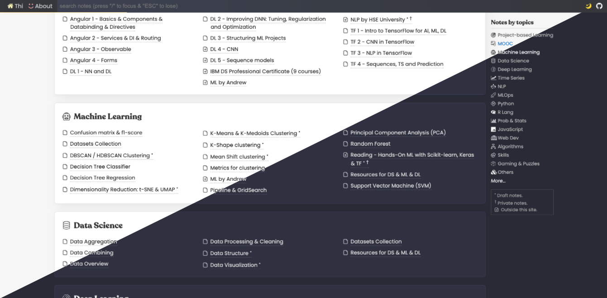
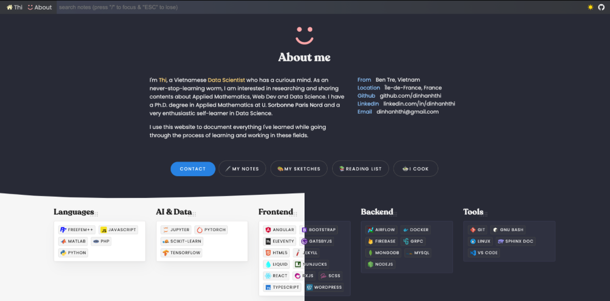
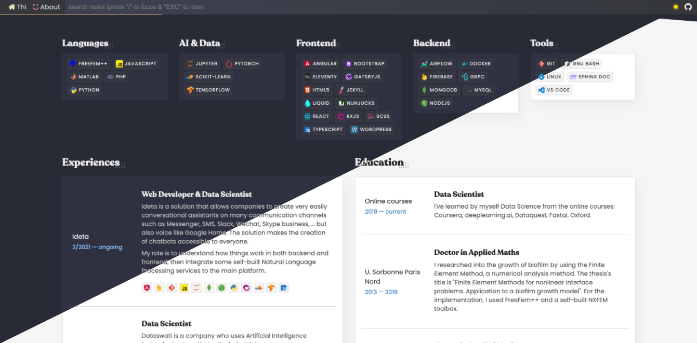
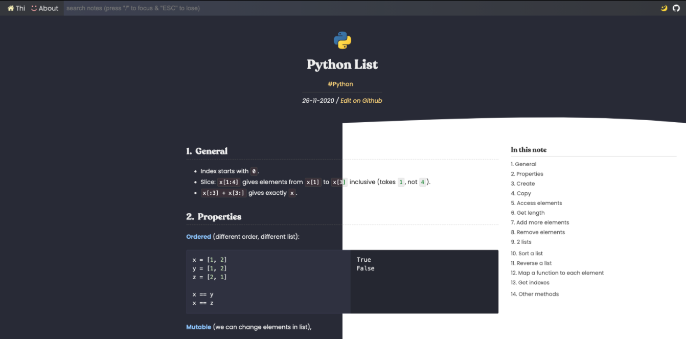

*This website is based on the [amazing theme](https://github.com/dinhanhthi/dinhanhthi.com) made by [Anh-Thi DINH](https://github.com/dinhanhthi/)*

*** 

# Theme README
# dinhanhthi.com in 11ty [](https://app.netlify.com/sites/inspiring-goldstine-cfc130/deploys)

⭐  __Demo__ (current version): https://dinhanhthi.com/ <br />
🚀  __Performance__: [Google Insight](https://developers.google.com/speed/pagespeed/insights/?url=https%3A%2F%2Fdinhanhthi.com). <br />

⛑  __Dev branch__: [`dev`](https://github.com/dinhanhthi/dinhanhthi.com/tree/dev) (working branch, always up-to-date) <br />
🌐  __Prod branch__: [`_site`](https://github.com/dinhanhthi/dinhanhthi.com/tree/_site) (already-built html files, what you see on [dinhanhthi.com](https://dinhanhthi.com))

## Older versions

There are several "old" versions (mainly built on **Jekyll**) with different themes.

👉 Version 0 (Jekyll): [v0.dinhanhthi.com](https://v0.dinhanhthi.com) -- [source](https://github.com/dinhanhthi/dinhanhthi.com/tree/v0-jekyll).<br />
👉 Version 1 (Jekyll): [v1.dinhanhthi.com](https://v1.dinhanhthi.com) -- [source](https://github.com/dinhanhthi/dinhanhthi.com/tree/v1-jekyll).<br />
👉 Version 2 (Jekyll): [v2.dinhanhthi.com](https://v2.dinhanhthi.com) -- [source](https://github.com/dinhanhthi/dinhanhthi.com/tree/v2-jekyll).<br />

## Illustrated photos (dark vs light)










## Features

1. High performance (customized from [Google's high performance theme](https://github.com/google/eleventy-high-performance-blog)).
2. Flexible on all devices.
3. Support many components for note taking in markdown (my styles 😉)
4. A ustomizable resume page.
5. Optimization images, html, css, javascript files.
6. Support instant search with hightlight (using [elasticlunr](http://elasticlunr.com/))
7. **[NEW]** Support Dark / Light Modes with a toggle button.
8. **[NEW]** Auto scrolling + expanding the TOC. When you scroll to some H2 heading, it will expand all of its H3 children if available. Try [this page](https://dinhanhthi.com/confusion-matrix-and-f1-score/) for an example.

## Build & dev locally

At the first time after cloning,

``` bash
# install nodejs
# https://github.com/nodesource/distributions/blob/master/README.md#installation-instructions

npm i # run once
```

```
# If you have any problem with the installation sharp?
# Try to change the python path to python2
# Best practice: create a python env containing python just for this task!

# In case you have python2 installed but it's not currently default
# You can choose python version in npm with
npm config set python python2
```

```
# If you have problems with libvips (MacOS??)?
# install it first
brew install vips
# then again,
npm i
```

Because of the weakness of eleventy, we have to do below things to make the dev locally much faster!

``` bash
# Install http-server to make a separated server
# (we don't intend to serve our eleventy site, just build it)
sudo npm install http-server -g

# Go to the main folder and then
mkdir _live

npm run local:build # a folder _site will be created

# Run the serve on folder _live
# (You need to do this everytime you restart the computer)
npm run local:serve

# Each time we want to build, run in another terminal
npm run local:build
```

### Update Fontello icons?

Upload the config file in `/src/fontello/config.json` to [fontello.com](https://fontello.com/) (by clicking on the spanner symbol). Add more icons you want. After choosing, click to "**Get config only**".

``` bash
# install fontello-cli
npm install -g fontello-cli

# install / update new icon
fontello-cli --config src/fontello/config.json --css src/fontello/css --font src/fontello/font install

# open src/fontello/font/fontello.css
# find: "../"
# and replace with: "/src/fontello/"

# check code in src/fontello/config.json
```

**Add a custom icon**?

1. Search for an icon (eg. svg images) + download to local.
   1. Free SVG icon: [site](https://uxwing.com/).
   2. If you need to crop some images? Use [this site](https://www.iloveimg.com/crop-image).
   3. Need to convert to svg? Use [this site](https://www.pngtosvg.com/).
2. Drag and drop this icon to fontello site.

## Working with themes?

``` bash
# Clone to another folder, let's say "dat.com-theme"
git checkout _play-with-theme

# Make changes on this folder ONLY FOR THEMES

# Using cherry-pick to update changes from _play-with-theme to dev COMMIT BY COMMIT
```

## Rules of thumb

1. Change `README.md` only on `dev` branch!!!
2. Don't change theme in `dev`, just in `_play-with-theme`!
3. Don't make changes in `pages` and `posts` folders!!

## Deploy to Netlify?

Check [this note](https://dinhanhthi.com/11ty-nunjucks/#setting-up-with-netlify) to understand below steps.

``` bash
# Merge changes from branch dev to branch _site
# Clone this repo to 2 separated folders
|
|- dinhanhthi.com	# <- branch "dev" for editing notes
|- dat.com		# <- branch "_site" for pushing to netlify

# more details
git clone git@github.com:dinhanhthi/dinhanhthi.com.git # already done in previous section
git clone git@github.com:dinhanhthi/dinhanhthi.com.git dat.com

# On dat.com/, just run
# (It takes time to build the whole site in dinhanhthi.com/)
sh ud_site.sh

# If you wanna make an alias (Linux, MacOS)
update_dat='cd ~/git/dat.com && sh ud_site.sh && cd -1'
# change "~/git/dat.com" to yours
```