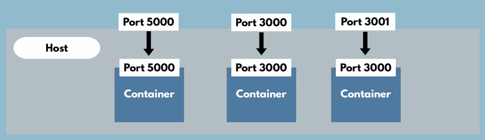
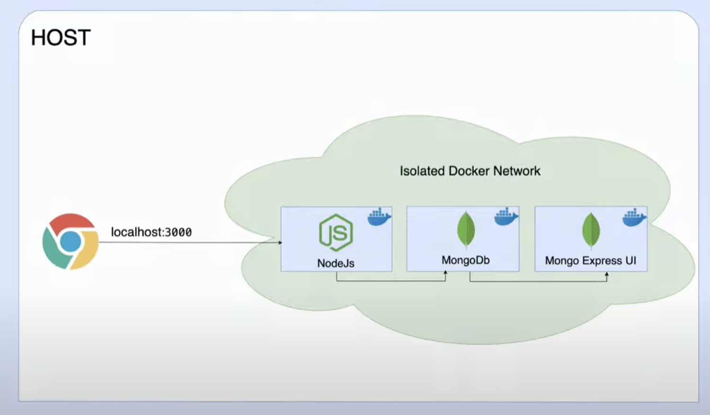
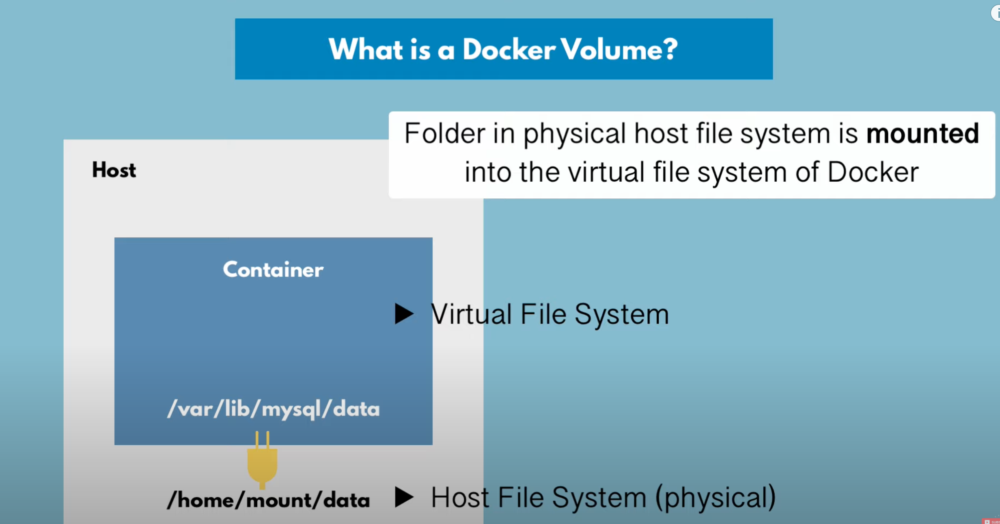

## Basics

### Running a docker container

```bash
> docker run postgres:9.6
Unable to find image 'postgres:9.6' locally
9.6: Pulling from library/postgres
99dcd33b7a52: Pull complete
e13f4e0a897f: Pull complete
13e4006bd82e: Pull complete
9ef5686a034a: Pull complete
49b36de2354f: Pull complete
c6aa3a5a53ef: Pull complete
df4a4b5f9f5e: Pull complete
60555f757ad0: Pull complete
55f848e849b0: Pull complete
5184cab49345: Pull complete
956c2539b051: Pull complete
34159ccae077: Pull complete
c61333c4cb33: Pull complete
435dde6f1790: Pull complete
Digest: sha256:63f752ed01a989d0b20be000743b9425069e35277523120cee077bee79931048
Status: Downloaded newer image for postgres:9.6
Error: Database is uninitialized and superuser password is not specified.
       You must specify POSTGRES_PASSWORD to a non-empty value for the
       superuser. For example, "-e POSTGRES_PASSWORD=password" on "docker run".

       You may also use "POSTGRES_HOST_AUTH_METHOD=trust" to allow all
       connections without a password. This is *not* recommended.

       See PostgreSQL documentation about "trust":
       https://www.postgresql.org/docs/current/auth-trust.html
```

Error is because postgress requires a password, so I try again

```bash
> docker run -e POSTGRES_HOST_AUTH_METHOD=true postgres:9.6
```

Note:
: **`docker run` will pull the image and start automatically**

### Look at running containers

```bash
> docker ps
CONTAINER ID   IMAGE          COMMAND                  CREATED         STATUS         PORTS      NAMES
ea3035896d4a   postgres:9.6   "docker-entrypoint.s…"   2 minutes ago   Up 2 minutes   5432/tcp   zealous_jang
```

This is an image. Docker has **images** and **containers**

1. Images are the actual packages (configuration, PostgresSQL, Start Script)

2. Container actually start the application(The running image. It contains the file system, env variables, etc.)

### Look at running and stopped containers

```bash
> docker ps -a
CONTAINER ID   IMAGE               COMMAND                  CREATED          STATUS                      PORTS      NAMES
ea3035896d4a   postgres:9.6        "docker-entrypoint.s…"   5 minutes ago    Up 5 minutes                5432/tcp   zealous_jang
3ed5928d2a7a   postgres:9.6        "docker-entrypoint.s…"   7 minutes ago    Exited (1) 7 minutes ago               frosty_banzai
7c2cd2c06579   postgres:9.6        "docker-entrypoint.s…"   8 minutes ago    Exited (1) 8 minutes ago               optimistic_bell
711510e39b55   postgres:9.6        "docker-entrypoint.s…"   9 minutes ago    Exited (1) 9 minutes ago               dreamy_lewin
8ac29a7e8a61   postgres:9.6        "docker-entrypoint.s…"   13 minutes ago   Exited (1) 13 minutes ago              gallant_swanson
7cb590a21f52   docker101tutorial   "/docker-entrypoint.…"   54 minutes ago   Exited (0) 50 minutes ago              docker-tutorial
4560b51c46e4   alpine/git          "git clone https://g…"   57 minutes ago   Exited (0) 57 minutes ago              repo
```

### Pull an image

```bash
> docker pull redis
Using default tag: latest
latest: Pulling from library/redis
968621624b32: Pull complete
6c8eacb95693: Pull complete
fb9503a65a3e: Pull complete
140c4202c2b0: Pull complete
07143683fefc: Pull complete
70407397a6a4: Pull complete
Digest: sha256:2f502d27c3e9b54295f1c591b3970340d02f8a5824402c8179dcd20d4076b796
Status: Downloaded newer image for redis:latest
docker.io/library/redis:latest
```

### Check all images on the system

```bash
> docker images
REPOSITORY          TAG                 IMAGE ID            CREATED             SIZE
redis               latest              6c8eacb95693       8 minutes ago       1.8 MB
docker101tutorial   latest    e02af24b34f8   About an hour ago   27.2MB
redis               latest    93f2223d3607   4 days ago          107MB
postgres            9.6       068f7f032002   5 days ago          191MB
alpine/git          latest    4ee6a3b79e0c   2 weeks ago         27.1MB
```

### Run container detached

```bash
> docker run -d redis
19cf3a6251fe6463d4468dbfa3f28053c5cc634fdde588d34b9e46552e726f57
```

### Stop Container

```bash
> docker stop 19cf3 # you don't need to specify the whole container id
```

### Container ports vs Host ports



#### Specify binding port

```bash
> docker run -p6000:6379 redis # -p[host:container]
```

### Specify container name

```bash
docker run -d --name my-redis redis
```

## Debugging containers

### Execute a command in a running container

```bash
> docker exec -it [id] /bin/bash
```

## Run vs. Start

Docker run will create a container from an image and start it.
Docker start will start a container that was already created.

## Developing with Docker

### Pull Images

```bash
> docker pull mongo
> docker pull mongo-express
```

### Docker Network



```bash
> docker network ls
NETWORK ID     NAME      DRIVER    SCOPE
b9502eda23b8   bridge    bridge    local
426b87e17873   host      host      local
d817a5c2e0f6   none      null      local
```

```bash
> docker network create mongo-network
> docker network ls
NETWORK ID     NAME            DRIVER    SCOPE
b9502eda23b8   bridge          bridge    local
426b87e17873   host            host      local
d69adcbb9546   mongo-network   bridge    local
d817a5c2e0f6   none            null      local
```

### Docker Environment Variables

Use the `e` flag to set environment variables.

```bash
> docker run -d \
> -p 27017:27017 \
> -e MONGO_INITDB_ROOT_USERNAME=root \
> -e MONGO_INITDB_ROOT_PASSWORD=password \
> --name mongodb \
> --net mongo-network \
> mongo
```

## Docker Compose

```yaml
version: "3"
services:
    mongodb:
        image: mongo
        ports:
        - "27017:27017"
        environment:
        MONGO_INITDB_ROOT_USERNAME: root
        MONGO_INITDB_ROOT_PASSWORD: password
    mongo-express:
        image: mongo-express
        ports:
        - "3000:3000"
        depends_on:
        - mongodb
```
Docker compose will create a network for the containers to share.

`depends=on` will start the container after the other container is started.

### Commands

```bash
> docker-compose mongo-compose.yaml up
> docker-compose mongo-compose.yaml down
```

`down` will also remove the network.

## Dockerfile

Blueprint for building images.

```dockerfile
# base image
FROM node

# you can set environment variables here as well
ENV MONGO_DB_USERNAME=admin \
    MONGO_DB_PASSWORD=password

# create /home/app folder
RUN mkdir -p /home/app

# Copy current folder files to /home/app
# COPY EXECUTES ON THE HOST MACHINE
COPY . /home/app

# start the app with "node server.js" - this is the entrypoint
CMD ["node", "server.js"]

```

### Make image

```bash
> docker build -t my-app:1.0 .
```

## Docker Volume



Data gets automatically replicated.

### 3 Volume Types

Host Volumes
: using `docker run` we specify the paths to the volumes `-v /host/path:/container/path`. You decide where in the host the volume is.

Anonymous Volumes
: using `docker run` we specify the paths to the volumes `-v /container/path`. The volume is created in the `/var/lib/docker/volumes` host directory.

Named Volumes
: using `docker run` we specify the paths to the volumes `-v name:/container/path`. The volume is created in the `/var/lib/docker/volumes` host directory. You can reference the volume by name. This is the one used in production.

### Docker volumes in Docker Compose

```yaml
version: "3"
services:
    mongodb:
        image: mongo
        volumes:
        - db-data:/var/lib/mysql/data
    mongo-express:
        image: mongo-express
        volumes:
        - mongodb_data:/data/db

# we must list all the volumes at the end
volumes:
    db-data
    mongodb_data
```

